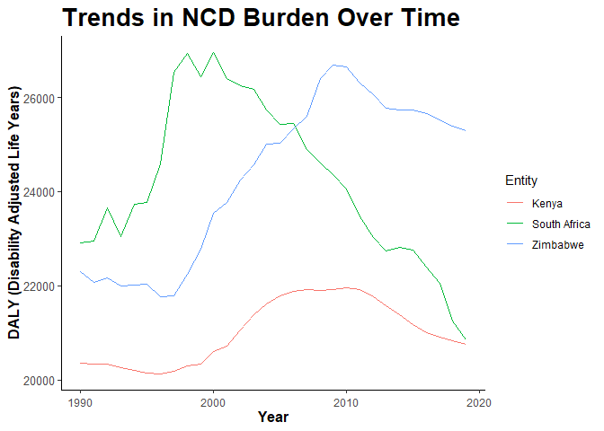

Global Disease Burden Analysis
================
Buntubethu Malunga & Irene Edward

# Introduction

This document compares the Disability-Adjusted Life Year (DALY) diseases
burden for three countries: COUNTRY 1, COUNTRY 2, and COUNTRY 3. We
compare the burden due to communicable, maternal, neonatal, and
nutritional diseases (CMNN), non-communicable diseases (NCDs), and
overall disease burden for these countries.

The source data is from the Institute for Health Metrics and Evaluation
(IHME) Global Burden of Disease (GBD) study.

# Communicable, Maternal, Neonatal, and Nutritional Disease Burden (CMNN)

    ## Rows: 8100 Columns: 4
    ## ── Column specification ────────────────────────────────────────────────────────
    ## Delimiter: ","
    ## chr (2): Entity, Code
    ## dbl (2): Year, DALYs (Disability-Adjusted Life Years) - Communicable, matern...
    ## 
    ## ℹ Use `spec()` to retrieve the full column specification for this data.
    ## ℹ Specify the column types or set `show_col_types = FALSE` to quiet this message.

## Table of Estimates for CMNN Burden Over Time

## Plot Showing Trends in CMNN Burden Over Time

## Summary of CMNN Burden Findings

Provide a brief analysis based on the data presented in the table and
chart. Highlight any significant findings or patterns. About 3
sentences.

# Non-Communicable Disease Burden (NCD)

    ## Rows: 8010 Columns: 4
    ## ── Column specification ────────────────────────────────────────────────────────
    ## Delimiter: ","
    ## chr (2): Entity, Code
    ## dbl (2): Year, DALYs (Disability-Adjusted Life Years) - Non-communicable dis...
    ## 
    ## ℹ Use `spec()` to retrieve the full column specification for this data.
    ## ℹ Specify the column types or set `show_col_types = FALSE` to quiet this message.

## Table of Estimates for NCD Burden Over Time

| Year |    Kenya | South Africa | Zimbabwe |
|-----:|---------:|-------------:|---------:|
| 1990 | 20354.82 |     22903.42 | 22297.56 |
| 1991 | 20339.57 |     22954.29 | 22078.26 |
| 1992 | 20340.00 |     23656.98 | 22174.33 |
| 1993 | 20271.11 |     23047.14 | 21996.56 |
| 1994 | 20204.09 |     23733.88 | 22021.09 |
| 1995 | 20149.65 |     23777.26 | 22042.96 |
| 1996 | 20127.12 |     24580.75 | 21774.05 |
| 1997 | 20191.31 |     26541.82 | 21796.51 |
| 1998 | 20305.86 |     26941.39 | 22245.64 |
| 1999 | 20344.43 |     26441.48 | 22772.21 |
| 2000 | 20601.02 |     26954.15 | 23533.63 |
| 2001 | 20723.42 |     26393.08 | 23763.29 |
| 2002 | 21065.24 |     26243.70 | 24243.05 |
| 2003 | 21378.17 |     26175.20 | 24570.26 |
| 2004 | 21616.73 |     25739.70 | 25012.97 |
| 2005 | 21790.17 |     25428.15 | 25031.35 |
| 2006 | 21891.77 |     25454.41 | 25326.42 |
| 2007 | 21925.87 |     24901.25 | 25598.20 |
| 2008 | 21910.39 |     24610.46 | 26396.70 |
| 2009 | 21919.55 |     24361.90 | 26693.76 |
| 2010 | 21950.12 |     24065.55 | 26658.05 |
| 2011 | 21927.98 |     23461.90 | 26309.51 |
| 2012 | 21775.13 |     23024.66 | 26052.00 |
| 2013 | 21570.74 |     22748.43 | 25770.62 |
| 2014 | 21379.63 |     22819.93 | 25733.12 |
| 2015 | 21182.04 |     22755.45 | 25729.90 |
| 2016 | 21012.47 |     22391.78 | 25657.87 |
| 2017 | 20907.66 |     22060.71 | 25518.09 |
| 2018 | 20832.75 |     21254.27 | 25381.47 |
| 2019 | 20749.39 |     20844.50 | 25297.14 |

## Plot Showing Trends in NCD Burden Over Time

<!-- -->

## Summary of NCD Burden Findings

Based on the chart, the NCD burden in South Africa was higher compared
to Kenya and Zimbabwe. Kenya had a lower DALY trend reaching a plateau
around 2007-2011. For South Africa, there is a notable spike just before
the year 2000, before the trend started to decline whereas the trend in
Zimbabwe increased exponentially around 1997 to 2010 before starting to
decrease.

# Overall Disease Burden

    ## Rows: 8100 Columns: 4
    ## ── Column specification ────────────────────────────────────────────────────────
    ## Delimiter: ","
    ## chr (2): Entity, Code
    ## dbl (2): Year, DALYs (Disability-Adjusted Life Years) - All causes - Sex: Bo...
    ## 
    ## ℹ Use `spec()` to retrieve the full column specification for this data.
    ## ℹ Specify the column types or set `show_col_types = FALSE` to quiet this message.

## Table of Estimates for Overall Disease Burden Over Time

## Plot Showing Trends in Overall Disease Burden Over Time

## Summary of Overall Disease Burden Findings

Provide a brief analysis based on the data presented in the table and
chart. Highlight any significant findings or patterns. About 3
sentences.
